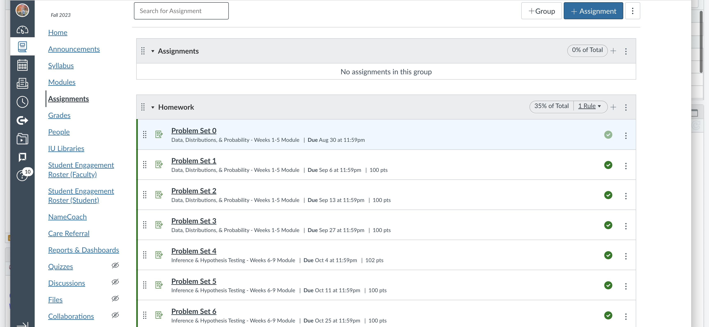
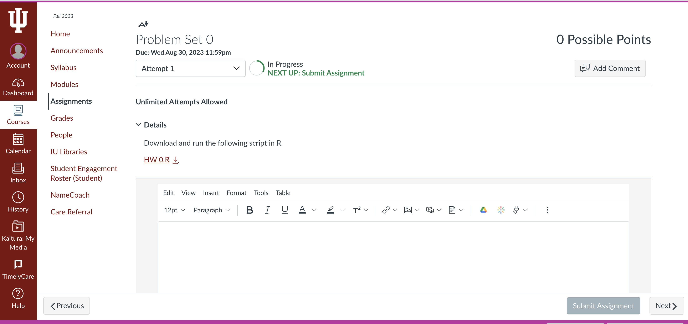
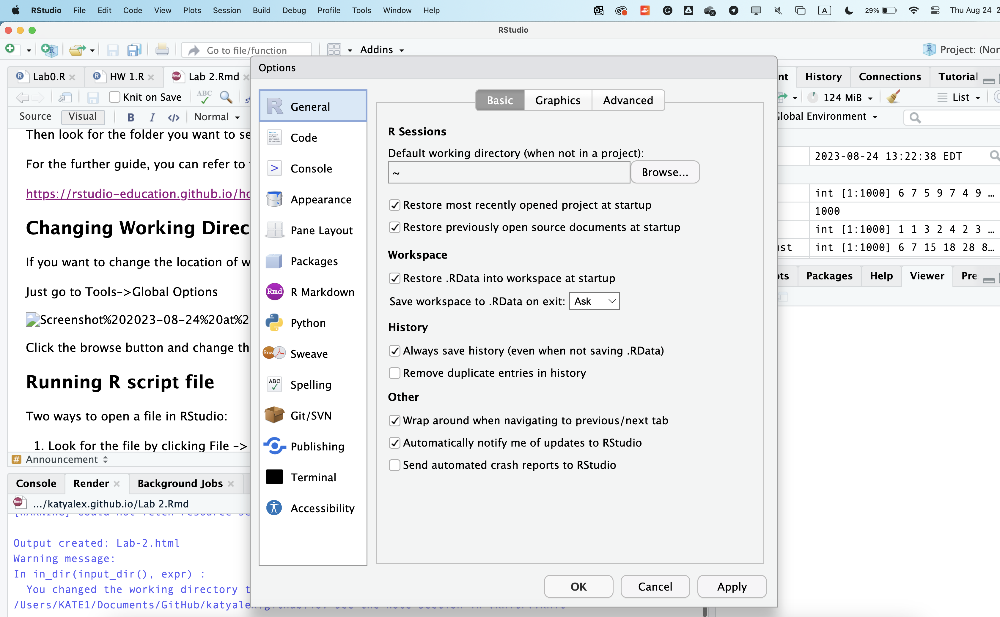
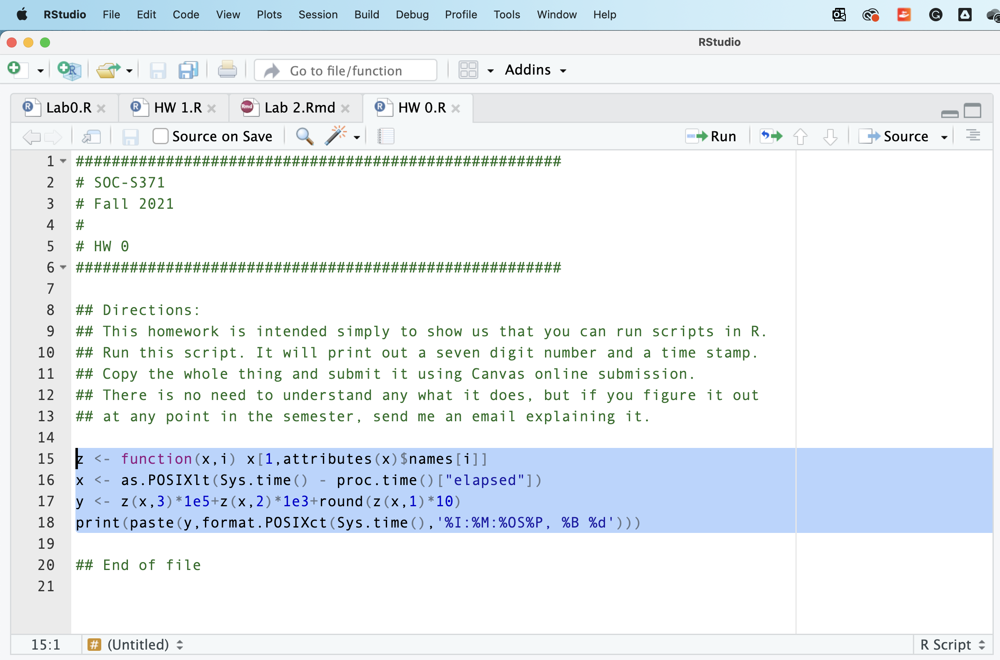

```{r setup, include=FALSE}
knitr::opts_chunk$set(echo = FALSE)
```

## Announcement

Please submit all assignments on Canvas in .doc, .docx, or .pdf file!

{style="display: block; margin: 0 auto" width="623"}

## Announcement

Click the Submit Assignment button and then upload the file

{style="display: block; margin: 0 auto" width="641"}

## Three ways to use RStudio

-   All on campus computers have RStudio installed
-   Using your own computer (recommended)
-   Log in to IUAnyWare and use RStudio remotely (less recommended)

<https://uits.iu.edu/services/technology-for-teaching/instruction-and-assessment-tools/iuanyware/index.html>

## R Code

-   R is case sensitive
-   For example, when you try to type the mean function:

```{r, echo = TRUE}
mean(1:8)
```

-   R would use the `mean()` function to do calculation and give you a valid output

```{r, echo = TRUE, error=TRUE}
Mean(1:8)
```

-   But if you type the function with capital letter, it will give you an error, because function `Mean()` *does not exist* in R

## R Code

-   R is also sensitive to space
-   For example, when you try to type the mean function in this way:

```{r, echo = TRUE, error = T}
mea n(1:8)
```

-   R can't recognize the function `mea n()`, because in R no function can have space in it.

## R Code

You also have to always have equal number of open and close parentheses

```{r, echo=TRUE, error=T}
mean(1:8
     
```

R would not give you a result. Instead you will see the `+` sign, which will encourage you to end the code of line.

## R Code

To resolve this issue you can either

1.  Add the missing parantheses

2.  Click ***Esc*** to terminate the running of a function

## Types of R files

1.  R script file It has the .R extension (e.g. HW0.R) and contains R codes
2.  R data file It has the .Rdata, .RData, .Rda, or .rda extension (e.g. HW4.RData)

## Loading scripts and files into R

*How can RStudio know the location of the file?*

1.  Click *File* --\> *Open File* in RStudio
2.  Type R code to tell R to load files from the working directory into RStudio

***Working directory*** is a folder that R will refer to when you ask it to load files. If the files that you ask to load are not in the working directory, R will give you an error.

You can change the location of the working directory either temporarily or permanently. I recommend to set up the working directory at the beginning of your code each time, because often you need to store files from different projects in different folders.

------------------------------------------------------------------------

To check working directory, type:

```{r, echo=T, global_options, include=TRUE}
getwd()
```

To change working directory, type:

```{r, echo=T}
setwd('/Users/KATE1/Desktop')
getwd() #To check that working directory changed, run this command again!
```

Now you can see that your working directory has changed!

## Changing Working Directory manualy

In RStudio, you can also change the location of the working directory going to Session --\> Set Working Directory --\> Choose Directory

Then look for the folder you want to set up as the working directory.

For the further guide, you can refer to this resource:

<https://rstudio-education.github.io/hopr/dataio.html>

## Changing Working Directory Permanently

If you want to change the location of working directory permanently, you can do it in RStudio.

Just go to Tools--\>Global Options

{style="display: block; margin: 0 auto" width="652"}

Click the browse button and change the default location of the working directory.

## Running R script file

Two ways to open a file in RStudio:

1.  Look for the file by clicking File --\> Open File in RStudio
2.  Type R code to load files from the working directory into RStudio

## Let's open R script file

0.  Go to your assignments on Canvas and open Problem Set 0
1.  Download HW0.R file
2.  In ***RStudio*** go to File --\> Open File
3.  Then look for the HW0.R script file in the place, where you downloaded it

## Let's run R script file

Highlight the lines of code that you want to run:

{style="display: block; margin: 0 auto" width="657"}

Then press the run button at the top of your script

*OR*

Mac Users: Command+Enter

Windows Users: Ctrl+Enter

## Comments

Anything that starts with \# is a comment and ignored by R

Comments are useful to make notes about your code, so that you know what you are doing.

```{r, echo = T}
## Directions:
## This homework is intended simply to show us that you can run scripts in R.
## Run this script. It will print out a seven digit number and a time stamp.
## Copy the whole thing and submit it using Canvas online submission.
## There is no need to understand any what it does, but if you figure it out
## at any point in the semester, send me an email explaining it.
```

## Another way to open R script

## Other slide

```{r cars, echo = TRUE}
summary(cars)
```

## Slide with Plot

```{r pressure}
plot(pressure)
```

## Slide with Histogram

```{r, echo = TRUE}
r=1
mean(1:8)
```
